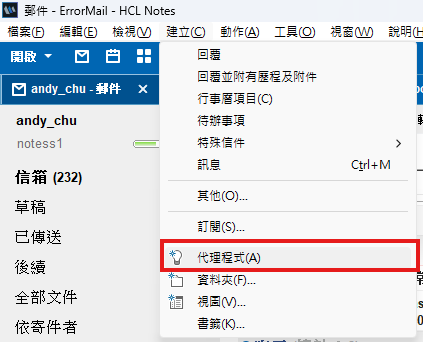
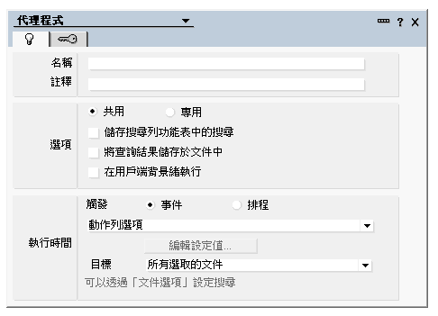
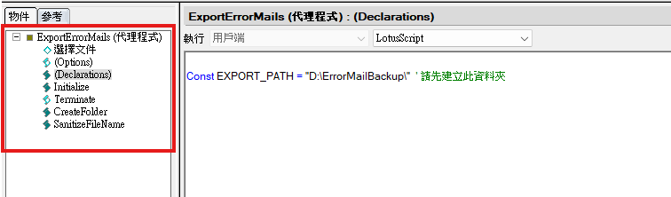
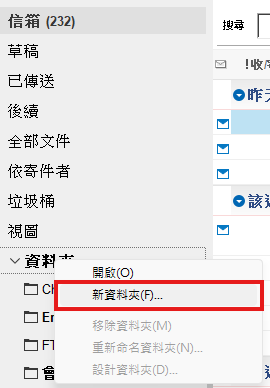
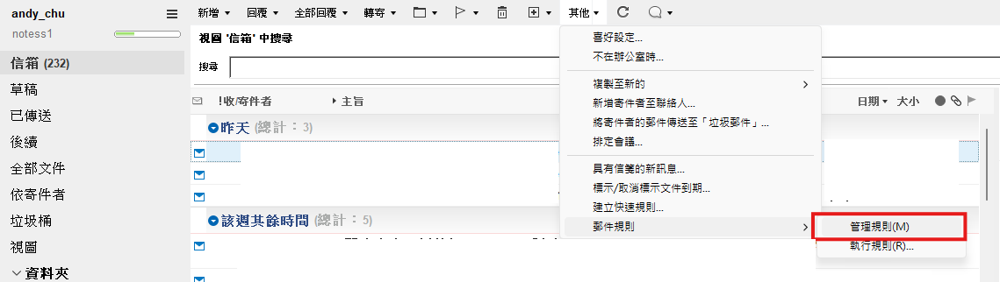
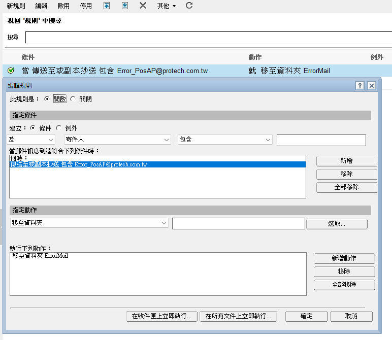
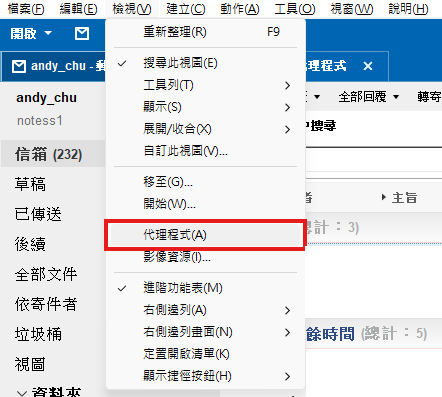
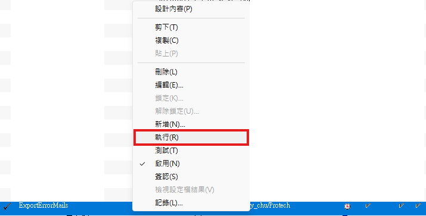
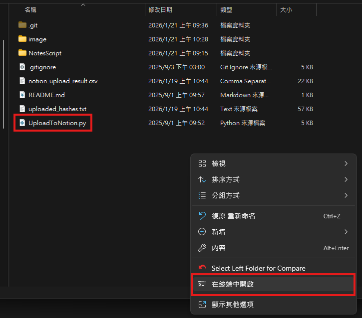

# NotesMailAutoUploadToNotion

這是一個 `HCL Notes` ErrorMail 整理的專案。
※ `HCL Notes` 以下簡稱 `Notes`。
目標 : 在 `Notes` 操作並可自動上傳至Notion，減少人工整理的操作問題以及跨平台即時查看並分析Error原因。

---

## 功能簡介
1. 在 `Notes` 執行
    * 需在 `Notes` 設定那些類型的信件為ErrorMail，並建立一個資料夾專門存放相關ErrorMail。
    * 存放條件可參考附圖
2. 過濾不須下載的信件
    * 有些ErrorMail為本團隊無需處理或測試用信件會在下載到本地端前先進行過濾。
    * 條件 : 
        1. 信件標題包含 `Crash` 、 `點餐通2.0` 
        2. 信件標題不包含 `異常回報` 、 `回覆` 、 `Re`
3. 從下載的資料夾上傳至Notion
    * 透過 Notion API來進行上傳，相關API說明可參考，[Notion 官方說明](https://developers.notion.com/docs/getting-started)

--- 

## 環境需求
* 需確認是否有登入 `Notes` ，並在**本地執行環境加入`.env`環境參數檔**，供程式讀取。
* 需確認是否有Notion帳號，並可以擁有Token，上傳時會根據Token將資料上傳至擁有該Token之WorkSpace。
* `.env` 參數檔須包含
    1. 本地目的地位址
    2. Notion上傳的Token(為了符合Notion規則)
    3. Notion上傳的Database ID(為了符合Notion規則)

--- 

## 使用方式
由於目前尚未將此功能實作服務化，因此仍須依賴本地端進行處理。
當上述需求皆已達成可進行以下步驟
1. 在 `Notes` 上方新增代理程式，並輸入此代理程式相關資訊。



2. 將代理程式依序新增


3. 建立ErrorMail存放資料夾


4. 建立ErrorMail存放資料夾的規則

* 規則


5. 在 `Notes` 執行代理程式



6. 在本地環境中開啟終端機並執行上傳至Notion，確認視窗中是否有UploadToNotion.py即可


7. 在終端機中執行指令，需確認本地電腦是否可以執行python，詳見常見問題。
```code
python UploadToNotion.py
```

## 常見問題(FAQ)
### 1. 程式已執行但沒有在Notion上查看
* 請確認登入 Notion 帳號是否正確。
* 請確認 Notion API 不可或缺的 Token 是否失效。

### 2. 終端機中執行指令錯誤
* 請確認本地電腦是否可以執行python，可直接在本地電腦開啟終端機中輸入指令
```code
python
```
如果此指令依然無法順利執行，表示本地電腦無法執行python，需下載才可繼續進行，可參考[python 官方網站](https://www.python.org/)。
* 請確認開啟之終端位置是否有**UploadToNotion.py**此檔案，如果沒有，需調整執行終端機的位址。

### 3. 為何已正確執行上傳但程式回報錯誤
* 可參考 `notion_upload_result.csv` 確認此次上傳的郵件中那些是正常上傳至Notion的，以下進行範例
```text
[Crash] [點餐通2.0] [XXXX有限公司] _ [XXXX店] [V5.XXXX]_2026_XX_XX,200,以下省略...
```
如上方店家後面不是出現`200`而是出現其他數字，則代表上傳不成功，需確認Notion伺服器、網路狀態...等原因。